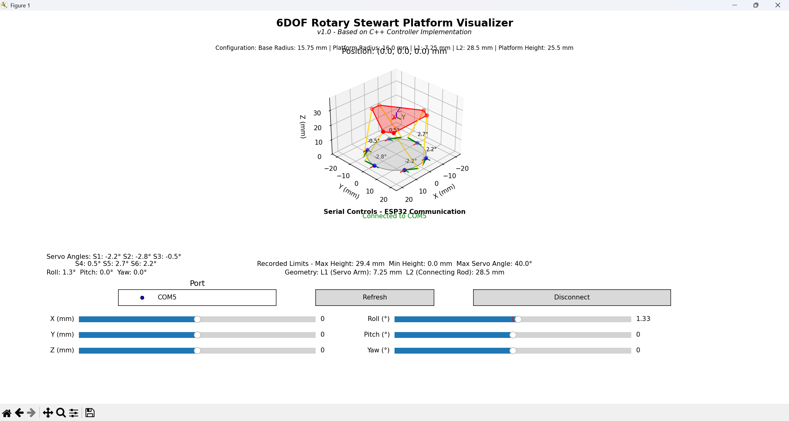

# 6DOF Rotary Stewart Motion Simulator Platform

## ⚠️ Current Status - Work In Progress

This branch is currently a work in progress and does not yet have full functionality. It is being actively developed and updated regularly as development continues.

### 🎯 Development Goals

1. 3D Visualization and ESP32 Integration
   - Implement working 3D visualization system
   - Establish ESP32 interface in debug mode
   - Create integration tests for position acceptance and verification
   - Develop real-time position feedback visualization

2. Hardware Improvements
   - Design and implement new PCB with differential output capabilities
   - Enhance position update speed and resolution
   - Implement robust noise rejection for more precise measurements

3. Additional Development Tasks
   - Implement comprehensive error handling and safety checks
   - Create calibration routines for improved accuracy
   - Develop diagnostic tools for system monitoring
   - Add configuration profiles for different use cases
   - Implement data logging and analysis features

Please note that features and functionality may be incomplete or change as development progresses.

[](https://opensource.org/licenses/MIT)
[](https://www.espressif.com/en/products/socs/esp32)
[](http://makeapullrequest.com)

> A high-performance 6 Degrees of Freedom motion simulator platform powered by AC servo motors with AASD15A drivers

⚠️ **SAFETY WARNING**: This is a DANGEROUS project. Improper assembly or operation can result in serious injury or death. Proceed with extreme caution and ensure all safety measures are in place.

## 🎥 Demo Videos

<div align="center">
  <a href="http://www.youtube.com/watch?feature=player_embedded&v=fEcdGIq_Jzc" target="_blank">
    
  </a>
  <a href="http://www.youtube.com/watch?feature=player_embedded&v=1WXx59tWYc4" target="_blank">
    
  </a>
</div>

<div align="center">
  <a href="http://www.youtube.com/watch?feature=player_embedded&v=_NR_MUGvmUo" target="_blank">
    
  </a>
  <a href="http://www.youtube.com/watch?feature=player_embedded&v=CdDkL8X6qOE" target="_blank">
    
  </a>
</div>

## 🌟 Features

- 6 AC servo motors with AASD15A Servo Drivers
- High-precision planetary gears for torque multiplication
- Real-time position processing at 1000Hz
- Soft pause/emergency stop functionality
- SimTools compatibility
- Interactive 3D visualization tool
- Scalable design with adjustable dimensions

## 🛠️ Components

### Controller (ESP32)
- PlatformIO-based project
- Dual-core utilization for 1000Hz refresh rate
- Custom MCP23S17 library for simultaneous motor control
- USB-Serial communication with SimTools

### Python Visualizer

<div align="center">
  
  <p><i>Visualizer showing the platform with control panel for position, orientation, and ESP32 communication</i></p>
</div>

- Accurate 3D visualization of the Stewart platform with real-time servo angles and connecting rod geometry
- Interactive position and orientation controls for X, Y, Z, Roll, Pitch, and Yaw
- COM port selection and ESP32 integration for physical platform control
- Constraint visualization showing geometric limitations and motion boundaries
- Clean, professional interface for testing control algorithms and verifying movement

### Hardware Components

#### Base Assembly
- 31" diameter steel plate (½ inch thick)
- 6x Couplers
- 6x 750W AC servo Motors
- 6x 50:1 Planetary Gears

#### Motion Components
- 12x 1/2" Panhard Bar Kits with Rod Ends
- 12x High Misalignment Spacers
- Steel tubing for arms and chassis

## ⚙️ Configuration

### SimTools Setup
```
Interface Output Format: <Axis1a>,<Axis2a>,<Axis3a>,<Axis4a>,<Axis5a>,<Axis6a>X
Axis Mapping: x, y, z, Ry, Rx, RZ
Baud Rate: 115200
Update Interval: 1ms
```

### AC Servo Settings (AASD-15A)
```
pn002 - Control Mode: "002"
pn003 - Servo enable: "001"
pn098 - Gear: "80"
pn109 - Position command deceleration mode: "002"
pn110 - Position command filtering time constant: "050"
pn111 - S-shaped filtering time constant Ta: "50"
pn112 - Position instruction Ts S-shaped filtering: "50"
```

#### Homing Configuration
```
pn033 - Power on homing: 3
pn034 - Direction: 0 (clockwise) or 1 (counter-clockwise)
pn036 - Coarse position: +/-11 X1000 pulses
pn037 - Fine position: +/-5000 (adjustable)
pn038 - Initial speed: 100
pn039 - Return speed: 100
```

## Platform Geometry

### Key Angular Parameters

#### THETA_P (θP) - Base Servo Pair Separation
- Value: 30 degrees
- Purpose: Defines the angular separation between servo motors within each pair on the base
- Each pair of servos (0-1, 2-3, 4-5) is mounted with this 30° separation
- Used to calculate the precise mounting positions of the servos on the base platform

#### THETA_R (θR) - Platform Connection Separation
- Value: 10 degrees
- Purpose: Defines the angular separation between connection points within each pair on the top platform
- Each pair of connection points is separated by this 10° angle
- Used to calculate the exact positions where the connecting rods (L2) attach to the moving platform

### Base Configuration
- Base Radius (RD): 15.75 inches
- Servo pairs are mounted at 120° intervals around the base (0°, 120°, 240°)
- Within each pair, servos are separated by THETA_P (30°)
- Individual servo angles: [150°, -90°, 30°, 150°, -90°, 30°]

### Platform Configuration
- Platform Radius (PD): 16 inches
- Connection points are arranged in pairs at 120° intervals
- Within each pair, points are separated by THETA_R (10°)
- Platform operates at a default height of 25.52 inches

### Arm Lengths
- Servo Arm Length (L1): 7.25 inches
- Connecting Arm Length (L2): 28.5 inches

### Motor Orientations (theta_s)
The servo motors are arranged in a specific pattern to optimize the platform's motion capabilities:

```
theta_s = [150°, -90°, 30°, 150°, -90°, 30°]
```

To understand theta_s:
1. The motors are numbered 0-5 around the hexagon
2. Each motor's shaft rotation axis points towards the center of the hexagon
3. The servo arms rotate in a plane perpendicular to this shaft axis
4. theta_s defines the angle of the servo arm relative to a perpendicular reference:
   - Motors 0 and 3: Arms rotate 150° from perpendicular
   - Motors 1 and 4: Arms rotate -90° from perpendicular
   - Motors 2 and 5: Arms rotate 30° from perpendicular
5. Motors are arranged in pairs (0-3, 1-4, 2-5) with matching theta_s values

This arrangement creates three "virtual pivot points" where pairs of motors work together to control the platform's motion. When viewed from above:
- Each motor's shaft rotation axis points directly to the hexagon's center
- The servo arms rotate in planes perpendicular to these shaft axes
- The theta_s angles determine the neutral position of each arm
- This configuration allows for optimal force distribution and motion range

### Motion Range
- Servo range: ±60 degrees from their theta_s position
- Platform can move in all 6 degrees of freedom:
  - Translation: X, Y, Z
  - Rotation: Roll, Pitch, Yaw

## 🚀 Getting Started

1. Review all safety documentation thoroughly
2. Assemble the hardware according to schematics
3. Flash the ESP32 with the controller firmware
4. Configure SimTools with the provided settings
5. Perform initial calibration and homing
6. Start with slow movements and gradually increase intensity

## 🤝 Contributing

Contributions are welcome! Please read our contributing guidelines and submit pull requests.

## ⚖️ License

This project is licensed under the MIT License - see the [LICENSE](LICENSE) file for details. The license includes a specific disclaimer about the dangerous nature of this project. By using any part of this project, you acknowledge that you are doing so at your own risk.

## 🔗 Links

- [SimTools Configuration Guide](documentation/images/simtools.png)
- [Build Documentation](documentation/)

---
*This project is part of the Phoenix branch, representing a complete modernization of the original implementation.*
