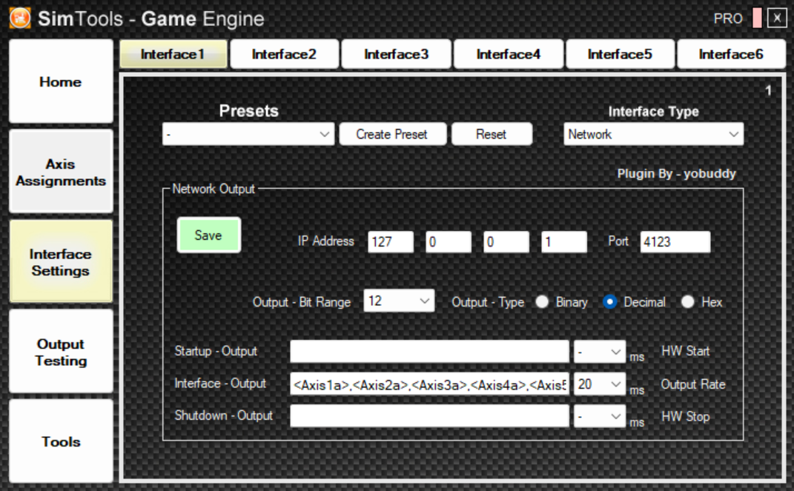

# 6DOF Rotary Stewart Motion Simulator Platform

[](https://opensource.org/licenses/MIT)
[](https://www.espressif.com/en/products/socs/esp32)

> A high-performance 6 Degrees of Freedom motion simulator platform powered by AC servo motors with AASD-15A drivers.

⚠️ **SAFETY WARNING**: This is a DANGEROUS project. Improper assembly or operation can result in serious injury or death. Ensure emergency stop systems are in place before any operation.

## Demo Videos

<div align="center">
  <a href="http://www.youtube.com/watch?feature=player_embedded&v=fEcdGIq_Jzc" target="_blank">
    
  </a>
  <a href="http://www.youtube.com/watch?feature=player_embedded&v=1WXx59tWYc4" target="_blank">
    
  </a>
</div>

<div align="center">
  <a href="http://www.youtube.com/watch?feature=player_embedded&v=_NR_MUGvmUo" target="_blank">
    
  </a>
  <a href="http://www.youtube.com/watch?feature=player_embedded&v=CdDkL8X6qOE" target="_blank">
    
  </a>
</div>

## Features

- 6 × 750 W AC servo motors with AASD-15A drivers and 50:1 planetary gears
- ESP32-S3 controller running native ESP-IDF v5.2.0 with 10 kHz deterministic control loop
- RMT peripheral for hardware-accelerated step pulse generation
- SN75174N RS-422 differential line drivers for STEP/DIR signaling to AASD-15A servo drivers
- SimTools compatible via UDP over Ethernet (W5500 SPI module)
- Native desktop control app (C++/OpenGL/ImGui) — single executable, no server, no browser
  - SIL simulation with real-time 3D visualization and servo readout
  - HIL mode: serial bridge to ESP32 at up to 1000 Hz TX rate
  - Multi-entity test bench: run SIL and HIL side-by-side with independent configs
  - Test signal generator with per-axis waveforms, smooth parameter interpolation
  - Motion capture recording and playback with speed control
  - Rolling spectrogram heatmap with multi-entity/axis overlay
  - SimTools UDP input with configurable bit depth
  - Shared C source with ESP32 firmware (IK, axis scaling, motion cueing)

## Repository Layout

| Directory | Contents |
|-----------|----------|
| `app/` | Native desktop app (C++/OpenGL/ImGui) — see [Desktop App](#desktop-app) below |
| `Controller/` | ESP32-S3 firmware (ESP-IDF v5.2) — see [Controller/README.md](Controller/README.md) |
| `test_harness/` | Step/dir signal analyzer firmware — see [test_harness/README.md](test_harness/README.md) |
| `docs/` | [Architecture](docs/ARCHITECTURE_ROADMAP.md), [IK research](docs/IK_RESEARCH.md), [Platform geometry](docs/platform_geometry.md) |
| `docs/firmware/` | [Step/Dir optimization roadmap](docs/firmware/esp32s3_step_dir_roadmap.md) |
| `docs/hardware/` | [Single motor test plan](docs/hardware/single_motor_test_plan.md), [HIL test plan](docs/hardware/hil_test_plan.md) |

## Quick Start

```bash
# 1. Clone
git clone https://github.com/knaufinator/6DOF-Rotary-Stewart-Motion-Simulator.git
cd 6DOF-Rotary-Stewart-Motion-Simulator/Controller

# 2. Build & flash (requires ESP-IDF v5.2.0)
idf.py set-target esp32s3
idf.py build
idf.py flash monitor
```

See [Controller/README.md](Controller/README.md) for prerequisites, debug UART, and build options.

## Desktop App

The desktop app is a single native C++ executable that replaces the former Python/browser dashboard. It compiles the same C firmware modules (IK, axis scaling, motion cueing) directly — no CFFI bridge, no JSON serialization on the hot path.

```bash
cd app
cmake -B build -DCMAKE_BUILD_TYPE=Release
cmake --build build --config Release
./build/Release/stewart-platform      # Linux/macOS
.\build\Release\stewart-platform.exe  # Windows
```

**Requires**: CMake 3.16+, C++17 compiler (MSVC, GCC, or Clang), OpenGL 3.3+

### App Features

- **Multi-entity test bench** — run multiple SIL/HIL entities with independent pipeline configs
- **Input sources** — manual sliders, SimTools UDP, test signal generator, capture playback
- **Test signals** — per-axis sine waves with configurable frequency/amplitude/phase, smooth live parameter changes, S-curve ramp envelope, presets
- **Recording & playback** — capture any input source, save to library, play back with speed control and looping
- **HIL serial bridge** — auto-detect COM port, auto-connect, binary protocol at up to 1000 Hz, real-time telemetry
- **3D visualization** — per-entity OpenGL Stewart platform renderer with orbit camera
- **Spectrogram** — rolling waterfall heatmap with multi-entity/axis lane selection
- **Data streams** — time-series charts, frequency analysis, recording library management
- **Console** — per-entity filtered log with configurable rate
- **Auto-save** — settings persist automatically including input source, entity configs, and HIL ports

## Communication Protocol

Two transports, both feeding the same binary packet handler. See [Controller/README.md](Controller/README.md) for full details.

### Serial (always active) — 115200 baud, 8N1 (USB CDC)

15-byte binary packet: `[0xAA] [0x55] [6 × uint16 LE] [XOR checksum]`

Legacy CSV also supported: `<v0>,…,<v5>X`

### UDP over Ethernet (opt-in) — W5500 SPI module

Compile with `-DENABLE_ETHERNET=1`. Sends 12 raw bytes (6 × `uint16_t` LE) to UDP port 4210. No sync/checksum needed — UDP provides framing. DHCP for IP assignment.

### SimTools Setup



| Setting | Value |
|---------|-------|
| Interface Type | Network |
| IP Address | `127.0.0.1` (SIL) or ESP32 IP (hardware) |
| Port | `4123` (SIL) or `4210` (hardware UDP) |
| Output - Bit Range | `12` |
| Output - Type | Decimal |
| Output Rate | 20 ms (SIL testing) / 1 ms (production target: 1000 Hz) |
| Axis Mapping | `x, y, z, Ry, Rx, Rz` |

For serial: Baud Rate `115200`, 8N1 (USB CDC — baud is nominal).

## AASD-15A Servo Settings

```
pn002 - Control Mode: "002"
pn003 - Servo enable: "001"
pn098 - Gear: "80"
pn109 - Position command deceleration mode: "002"
pn110 - Position command filtering time constant: "050"
pn111 - S-shaped filtering time constant Ta: "50"
pn112 - Position instruction Ts S-shaped filtering: "50"

Homing:
pn033 - Power on homing: 3
pn034 - Direction: 0 (CW) or 1 (CCW)
pn036 - Coarse position: +/-11 ×1000 pulses
pn037 - Fine position: +/-5000
pn038 - Initial speed: 100
pn039 - Return speed: 100
```

## Hardware

- **Base**: 31″ diameter × ½″ steel plate
- **Motors**: 6 × 750 W AC servos + 50:1 planetary gears + couplers
- **Linkage**: 12 × ½″ Panhard bar kits with rod ends and high-misalignment spacers
- **Interface**: SN75174N quad RS-422 line drivers — see [single motor test plan](docs/hardware/single_motor_test_plan.md)
- **Geometry**: See [docs/platform_geometry.md](docs/platform_geometry.md)

## Testing

```bash
# Firmware build
cd Controller && idf.py build

# Desktop app
cd app && cmake -B build -DCMAKE_BUILD_TYPE=Release && cmake --build build --config Release

# Step/dir signal analyzer (ESP-to-ESP testing)
cd test_harness && idf.py build
```

## License

MIT — see [LICENSE](LICENSE). By using any part of this project you acknowledge you do so **at your own risk**.
