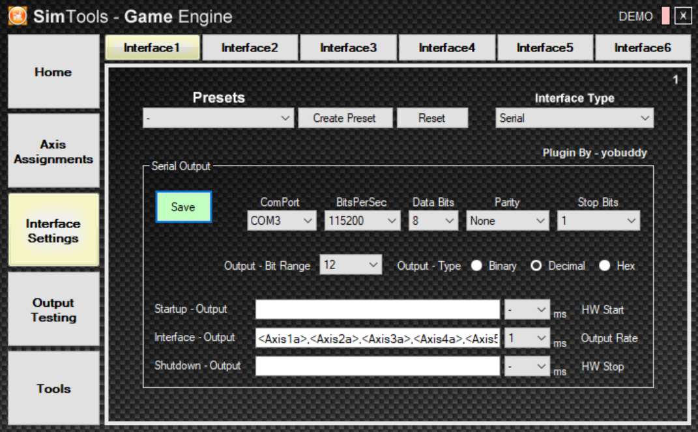
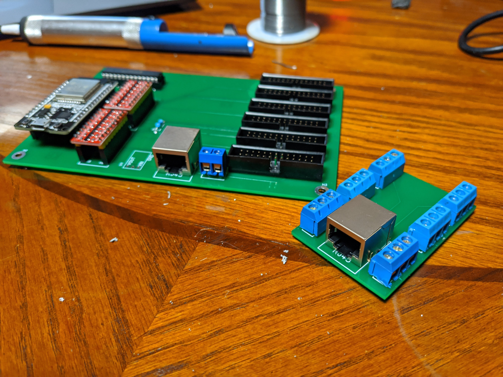
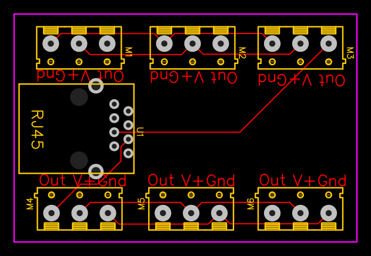
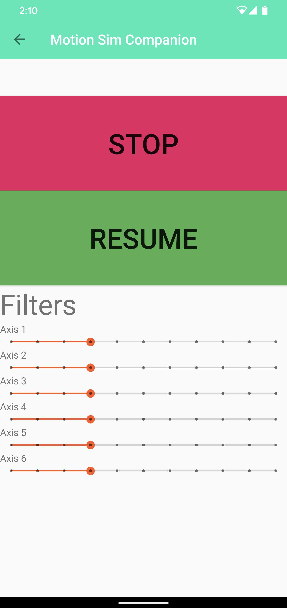

# 6DOF Rotary Stewart Motion Simulator Platform
Compact yet powerful motion simulator platform utilizing 6 AC servo motors with AASD15A Servo Drivers. High precision planetary gears used to multiply the torque. Custom PCB using an ESP32 microcontroller to process the platform position. Features a soft pause/estop button to prevent position updates from the PC.

## Phoenix Branch - Work in Progress
This branch (Phoenix) represents a complete overhaul and modernization of the original project. It's an experimental branch where I'm exploring the capabilities of modern AI tools while reorganizing and optimizing every aspect of the codebase. This serves as both a learning exercise and an opportunity to improve the project's structure, documentation, and overall maintainability.

Key focus areas:
- Reorganizing the codebase for better clarity and maintainability
- Optimizing code and configurations
- Improving documentation and project structure
- Exploring modern development practices and tools
- Using this as a personal learning experience in AI-assisted development

**Note**: This branch is actively being developed and may contain significant changes from the original implementation.

This platform is scalable, and most dimensions are changeable within reason. Certain general design rules will need to be followed for the platform to function correctly.

## Disclaimer 
This is a DANGEROUS project, and if absolute care is not taken you will be injured or killed.

# Project Components

## Controller
This is an ESP32 PlatformIO project that interfaces with the PC through software like SimTools to control AASD15A AC Servo Drivers. The project utilizes both ESP32 cores to maximize refresh rates to 1000Hz (1ms interval). A custom MCP23S17 library is included so the outputs of all 6 motors can be set simultaneously instead of individually, improving efficiency and allowing for higher movement precision.

### Python Visualizer
A 3D visualization tool built with PyVista that allows you to:
- View the platform's motion in real-time
- Test different motion patterns (sine wave, circular, figure-eight)
- Connect to SimTools for live visualization
- Interact with the view (zoom, rotate, pan)

## SimTools Interface Setup
Config for PC to ESP32 USB->Serial connection within SimTools. SimTools is configured to send 6 axis parameters to the ESP32 every 1ms over a 115200 baud connection. The packet consists of 6 12-bit values (0-4094), delimited by commas and ended by an "X" character.

SimTools Configuration:
- "Interface - Output" = \<Axis1a>,\<Axis2a>,\<Axis3a>,\<Axis4a>,\<Axis5a>,\<Axis6a>X
- Axis representations: x, y, z, Ry, Rx, RZ

## Controller and Sensor Array Schematics
Schematic of the current Controller and Sensor array PCB

## Controller PCB
Gerber files for ordering current Controller and Sensor Array PCB

## PCB Debugger
Arduino program for testing GPIO-motor outputs using a multimeter. Toggles all ports on/off at 5-second intervals for debugging non-moving motors and cold solder joints.

Test points:
- Pin 2 (step) vs ground
- Pin 9 (dir) vs ground

## Android App
This is a test application that will connect to the ESP32 microcontroller driving the AC servos, currently can stop/resume movement, and early filter adjustments. further functionality will be added to this as time progresses.

## Platform Test Application
.Net Application for testing position limits and speed of platform. Allows for manual setting of each DOF / Axis. As well works with XBOX360 controller through the PC USB wireless adapter.

## Parts
These are some key parts I used, others can be used in their place, but variations of the AC Servo motor may not be compadible with the PCB, and may require a modified PCB schematic. 

## Controller 
Main components on the PCB
* [ESP32 Dev board](https://amzn.to/2OkGpuj) - ESP32 Dev kit
* [MCP23S17](https://amzn.to/32UCSsQ) -
* [3.3V to 5V TTL Shifter Module](https://amzn.to/2VRh3sA) -
* [NJK-5002C NPN NO（Normally Open)Hall Effect Sensor Switch](https://amzn.to/2vSzzX8)

## Base
- Steel plate ½ inch thick 31” diameter
- 6 - Coupler https://amzn.to/2slOiIa

## Drive
* [6 - 750w AC servo Motors](https://www.aliexpress.com/item/32844239563.html)
* [6 - 50:1 Planetary Gears](https://www.aliexpress.com/item/32967571001.html)
*Note ensure planetary gear input diameter matches up to both the motor as well with the coupler output diameter when ordering from Aliexpress

## Connecting Arms

* [12 - 1/2 X 1/2-20 Economy Panhard Bar Kit with Bung .065, Rod End, Heim Joint](https://amzn.to/2FQffak)
* [12 - 1/2-3/8 High Misalignment Spacers, Rod End Spacers](https://amzn.to/2tm1jlF)
* [6 - 24" long 1" OD X .870 ID X .065 Wall Steel tubing]()

## Swing Arms
- 6 - 8" long 1" OD X .870 ID X .065 Wall Steel tubing
- 6 - 3/8"-16 Long Coped Steel Bungs

## Chassis
* [Vesa Monitor mount](https://amzn.to/2TmVS0f)
* [Coped Steel Bungs](https://amzn.to/2TGOcoo)
* [1" OD X .870 ID X .065 Wall Steel tubing](https://amzn.to/3au4FCQ)

## Extras as built in demonstration video
* [LG 34" Ultrawide](https://amzn.to/2t8YvbC)
* [Thrustmaster T16000M FCS](https://amzn.to/30qkHtY)
* [Wind Generator Fan](https://amzn.to/36W1um9)
* [Wind Generator PWM Control](https://amzn.to/2Ns1anq)
* [Wind Generator 90 Degree angle 3"-> 2" Reducer](https://amzn.to/2uN6J9z)
* [Wire Wrap](https://amzn.to/2u3jiNu)

## AC Servo motor settings
These are my settings on the Servo Driver aasd-15a these both enable specific modes as well define the time it should take to accelerate and decelerate the platform before it hits max speed. This is useful for when you want to protect the platform from self destruction due to the fast movements. Make them to large and the platform will feel slugish.
- pn002 - Control Mode - "002"
- pn003 - Servo enable - "001"
- pn098 - Gear - "80"
- pn109 - Position command deceleration mode- "002"
- pn110 - Position command a filtering time constant - "050"
- pn111 - S-shaped filtering time constant Ta position instruction - "50"
- pn112 - position instruction Ts S-shaped filtering time constant Ts - "50"

Input Designation
- pn52 - 23 Sigin 1 - homing trigger

Home location after sensor is activated
- pn36 - +/-11 X1000 pulses to get you in the ballpark area after home trigger
- pn37 - ~ +/-5000 as needed for precision to finish off where you want the arm to land after home trigger
- pn38 - 100 init speed
- pn39 - 100 back home speed

homing rotation direction settings
- pn033 -3 power on homing 
- pn034 - 0 clockwise
- pn034 - 1 counter clockwise
