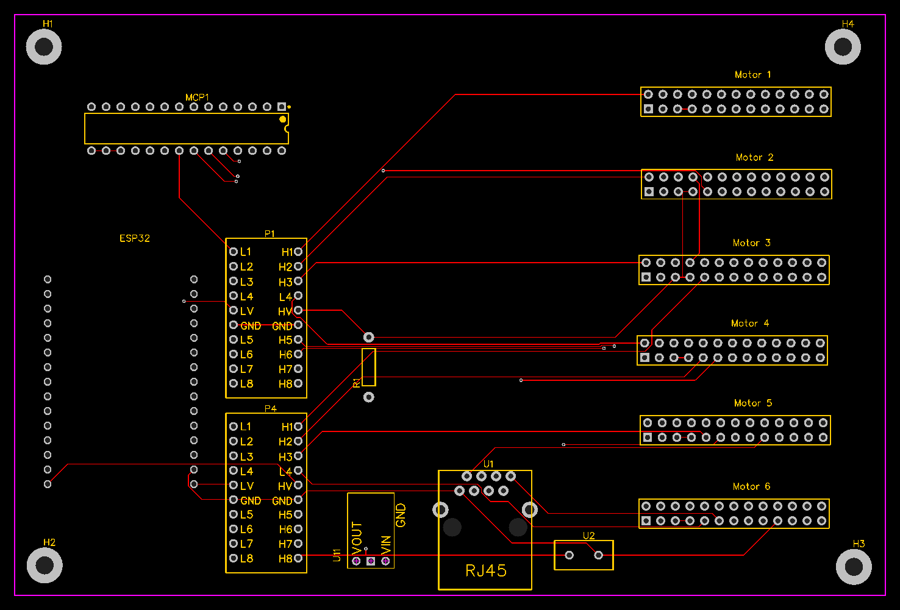

# 6DOF Rotary Stewart Motion Simulator Platform

[](https://opensource.org/licenses/MIT)
[](https://www.espressif.com/en/products/socs/esp32)
[](http://makeapullrequest.com)

> A high-performance 6 Degrees of Freedom motion simulator platform powered by AC servo motors with AASD15A drivers

⚠️ **SAFETY WARNING**: This is a DANGEROUS project. Improper assembly or operation can result in serious injury or death. Proceed with extreme caution and ensure all safety measures are in place.

## 🎥 Demo Videos

<div align="center">
  <a href="http://www.youtube.com/watch?feature=player_embedded&v=fEcdGIq_Jzc" target="_blank">
    
  </a>
  <a href="http://www.youtube.com/watch?feature=player_embedded&v=1WXx59tWYc4" target="_blank">
    
  </a>
</div>

<div align="center">
  <a href="http://www.youtube.com/watch?feature=player_embedded&v=_NR_MUGvmUo" target="_blank">
    
  </a>
  <a href="http://www.youtube.com/watch?feature=player_embedded&v=CdDkL8X6qOE" target="_blank">
    
  </a>
</div>

## 🌟 Features

- 6 AC servo motors with AASD15A Servo Drivers
- High-precision planetary gears for torque multiplication
- Custom PCB with ESP32 microcontroller
- Real-time position processing at 1000Hz
- Soft pause/emergency stop functionality
- SimTools compatibility
- Interactive 3D visualization tool
- Scalable design with adjustable dimensions

## 🛠️ Components

### Controller (ESP32)
- PlatformIO-based project
- Dual-core utilization for 1000Hz refresh rate
- Custom MCP23S17 library for simultaneous motor control
- USB-Serial communication with SimTools

### Python Visualizer
- Real-time 3D visualization using PyVista
- Test patterns: sine wave, circular, figure-eight
- SimTools live visualization support
- Interactive view controls (zoom, rotate, pan)

### Hardware Components

#### Controller PCB


Main Components:
- ESP32 Dev board
- MCP23S17
- 3.3V to 5V TTL Shifter Module
- NJK-5002C NPN NO Hall Effect Sensors

#### Base Assembly
- 31" diameter steel plate (½ inch thick)
- 6x Couplers
- 6x 750W AC servo Motors
- 6x 50:1 Planetary Gears

#### Motion Components
- 12x 1/2" Panhard Bar Kits with Rod Ends
- 12x High Misalignment Spacers
- Steel tubing for arms and chassis

## ⚙️ Configuration

### SimTools Setup
```
Interface Output Format: <Axis1a>,<Axis2a>,<Axis3a>,<Axis4a>,<Axis5a>,<Axis6a>X
Axis Mapping: x, y, z, Ry, Rx, RZ
Baud Rate: 115200
Update Interval: 1ms
```

### AC Servo Settings (AASD-15A)
```
pn002 - Control Mode: "002"
pn003 - Servo enable: "001"
pn098 - Gear: "80"
pn109 - Position command deceleration mode: "002"
pn110 - Position command filtering time constant: "050"
pn111 - S-shaped filtering time constant Ta: "50"
pn112 - Position instruction Ts S-shaped filtering: "50"
```

#### Homing Configuration
```
pn033 - Power on homing: 3
pn034 - Direction: 0 (clockwise) or 1 (counter-clockwise)
pn036 - Coarse position: +/-11 X1000 pulses
pn037 - Fine position: +/-5000 (adjustable)
pn038 - Initial speed: 100
pn039 - Return speed: 100
```

## 📝 Documentation

### Schematics
<div align="center">
  
  
</div>

## 🚀 Getting Started

1. Review all safety documentation thoroughly
2. Assemble the hardware according to schematics
3. Flash the ESP32 with the controller firmware
4. Configure SimTools with the provided settings
5. Perform initial calibration and homing
6. Start with slow movements and gradually increase intensity

## 🤝 Contributing

Contributions are welcome! Please read our contributing guidelines and submit pull requests.

## ⚖️ License

This project is licensed under the MIT License - see the LICENSE file for details.

## 🔗 Links

- [SimTools Configuration Guide](documentation/images/simtools.png)
- [Build Documentation](documentation/)
- [PCB Design Files](documentation/Controller%20Schematic/)

---
*This project is part of the Phoenix branch, representing a complete modernization of the original implementation.*
