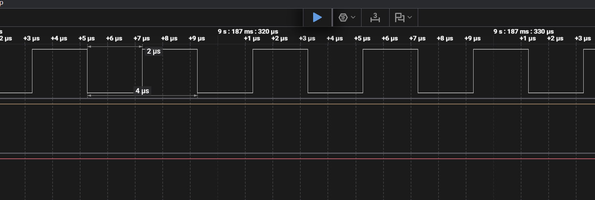

# Desktop App — 6DOF Rotary Stewart Motion Simulator

[Repository overview](../README.md) · [Controller](../controller/README.md) · [Hardware](../hardware/README.md) · [Build guide](../docs/BUILD.md) · [Firmware variants](../docs/FIRMWARE.md) · [App guide](../docs/APP_GUIDE.md)

For the repository-local MCP bridge, isolated hardware-disabled launches and real UI captures, see [App automation](../docs/APP_AUTOMATION.md).

Paths and commands in this overview start at the repository root unless noted
otherwise. `app/` contains the desktop application and `app/bridge/` its optional
Linux HIL bridge. Controller firmware is separate in `controller/`; shared guides
are in `docs/`. The detailed project overview and demos are preserved below.

> **UNTESTED PCB PROTOTYPE — 2026-09-23.** The 6DOF 2 r13 PCB is placed, routed and
> saved/reopened with zero native DRC errors. The complete RC4 prototype file package
> is provided; actual JLC stackup, allocation and assembly approval remain pending.
> It is intended for an upcoming prototype order and bench testing, but has not been ordered,
> manufactured or validated as a working controller. Firmware corrections are
> deferred and required before drive-connected operation. Do not use the current
> firmware/PCB combination on a powered motion platform. See the
> [hardware status and files](../hardware/pcb/6DOF2_BOARD.md) and
> [required firmware and commissioning work](../hardware/pcb/6DOF2_FIRMWARE_TODO.md).

[](https://opensource.org/licenses/MIT)
[](https://www.espressif.com/en/products/socs/esp32s3)
[](https://docs.espressif.com/projects/esp-idf/en/v5.5/)
[](#stepper-backend)

> A full-stack 6DOF motion simulator: ESP32-S3 firmware with 250 kHz hardware-timed step generation, a native C++ desktop control application, and a signal validation toolchain for hardware-in-the-loop development.

<div align="center">
  <a href="https://www.paypal.me/knaufinator">
    
  </a>
</div>

⚠️ **SAFETY WARNING**: This project involves heavy rotating machinery capable of serious injury or death. Emergency stop hardware must be in place before any powered operation.

<div align="center">
  
  <br><em>Desktop documentation capture — synthetic SIL demonstration; no connected hardware or measured r13 telemetry.</em>
</div>

Actual app screenshot using synthetic SIL data, not hardware telemetry. See the [app guide](../docs/APP_GUIDE.md) for controls and the [automation guide](../docs/APP_AUTOMATION.md) to reproduce documentation captures.

### What You're Looking At

- **Toolbar** — Plugin/capture source selector, START/STOP/E-STOP, record/playback controls and entity counts. Add entities through the **Entity** menu.
- **Input Strip** — Live per-axis channel mapping (Assetto Corsa shared memory, SimTools UDP, test signals) with configurable ranges and invert toggles
- **SIL Entity** — Software-in-the-Loop: interactive 3D Stewart platform visualization with orbit camera and servo angle readout
- **HIL Entity** — connection settings and telemetry displays for hardware work. Documentation examples are disconnected/offline; they do not validate r13 firmware or the PCB.
- **Dynamics Panel** — Per-entity signal processing pipeline, MCA washout filters, per-axis low-pass and notch controls. Edits are staged until **Apply**; **Revert** discards staged edits.
- **Data Streams** — **Recording**, **Snapshot**, **Time-Series**, and **Spectrogram** tabs
- **Entity tabs** — **Overview**, **Dynamics**, **Settings**, **Platform**, **Test Harness** (HIL only), and **I/O**

See the [illustrated app guide](../docs/APP_GUIDE.md) for geometry, recording/playback and offline HIL workflows. Use **File → Reset Window Layout** to restore the default panel layout.

Everything runs in a single native executable — no browser, no server, no Python runtime. The same C source modules (inverse kinematics, axis scaling, motion cueing) compile into both the desktop app and the ESP32-S3 firmware.

## Demo Videos

<div align="center">
  <a href="http://www.youtube.com/watch?feature=player_embedded&v=fEcdGIq_Jzc" target="_blank">
    
  </a>
  <a href="http://www.youtube.com/watch?feature=player_embedded&v=1WXx59tWYc4" target="_blank">
    
  </a>
</div>

<div align="center">
  <a href="http://www.youtube.com/watch?feature=player_embedded&v=_NR_MUGvmUo" target="_blank">
    
  </a>
  <a href="http://www.youtube.com/watch?feature=player_embedded&v=CdDkL8X6qOE" target="_blank">
    
  </a>
</div>

## Hardware

- **Base**: 31″ diameter × ½″ steel plate
- **Motors**: 6 × 750 W AC servo motors + 50:1 planetary gearboxes + couplers
- **Drivers**: AASD-15A servo drives (step/dir input, RS-422 differential signaling)
- **Controller**: ESP32-S3 custom PCB ("6DOF 2", PCBv2; r13 routed, untested prototype — four layers, W5500 Ethernet, six DB25 servo ports, conditioned alarm inputs and supervised stop/inhibit). RC4 prototype files complete; JLC approval and physical testing pending. [Hardware files and revision status](../hardware/pcb/6DOF2_BOARD.md), [firmware TODO](../hardware/pcb/6DOF2_FIRMWARE_TODO.md).
- **Signal interface**: AM26LS31 quad RS-422 line drivers on STEP/DIR lines (on the board)
- **Linkage**: 12 × ½″ Panhard bar kits with rod ends and high-misalignment spacers

## Stepper Backend

The ESP32-S3 firmware uses a pluggable stepper backend selected at compile time in `controller/main/CMakeLists.txt`.

### Active: `STEP_DRIVER_SHARED_MCPWM` — 250 kHz target; corrective validation pending

The capture below is historical evidence for a particular single-channel test, not
acceptance of the current six-axis firmware or r13 PCB. The September 22 review
found an unsuppressed-waveform path during direction guards and software counters
that cannot independently prove pulse output. Reversal, idle and stop behavior must
be corrected and externally measured before connecting drives; see the firmware TODO.

```
1 MCPWM timer (group 0) → 3 operators → 6 comparator/generator chains
  Each motor: TEZ → HIGH (rising edge), compare match → LOW (falling edge)
  All pulse edges generated in silicon — zero CPU per pulse
```

- Step pulses are generated entirely in silicon — zero CPU per pulse
- ISR only updates comparator register + position counter per step
- Step rate: up to **250 kHz per motor**, hardware-enforced timing
- Pulse width: **2 µs** (meets AASD-15A ≥1.5 µs minimum)
- Intended DIR guard: ≥8 µs; current guard implementation requires correction and independent waveform verification before use

**Logic analyzer validation — GPIO4 (STEP), 24 MS/s capture:**

<div align="center">
  
  <br><em>SharedMcpwmStepEngine — 250 kHz, 50% duty cycle, 2 µs pulse width. Validated with Saleae Logic 2 at 24 MS/s.<br>SIGTEST: 50,000/50,000 steps, pos_error=0, PASS.</em>
</div>

### Other backends (compile-time selectable)

| Define | Engine | Max rate | Notes |
|--------|--------|----------|-------|
| `STEP_DRIVER_SHARED_MCPWM` | SharedMcpwmStepEngine | 250 kHz | **Active.** 1 timer, 6 hw comparators, fully hardware-driven pulses |
| `STEP_DRIVER_MCPWM` | MCPWMMotorControl | 250 kHz | Per-motor MCPWM + PCNT/RMT. Complex, legacy |
| `STEP_DRIVER_MCPWM_ISR` | McpwmStepEngine | 125 kHz | Single MCPWM TEZ ISR, all 6 motors |
| `STEP_DRIVER_SSE` | SimpleStepEngine | 125 kHz | GPTimer ISR reference implementation |

## Project Layout

| Directory | Contents |
|-----------|----------|
| `controller/` | ESP32-S3 firmware (ESP-IDF v5.5) |
| `controller/include/` | `StepDriver.h`, `McpwmStepEngine.h`, `SimpleStepEngine.h`, `MCPWMMotorControl.h` |
| `app/` | Native desktop app (C++/OpenGL/ImGui) |
| `controller/tools/` | Python serial diagnostic and signal validation scripts |
| `controller/test_harness/` | ESP32 step/dir signal analyzer firmware (ESP-to-ESP HIL testing) |
| `docs/` | App guide, architecture notes, IK research and screenshots |
| `controller/mini/` | ESP32 hobby-servo firmware variant |
| `app/bridge/` | Linux HIL bridge service |
| `controller/stewart-core/` | Shared IK, scaling and cueing Git submodule |
| `controller/tests/` | Host-side regression tests |

PCB packages and board guides are in [`../hardware/pcb/`](../hardware/pcb/);
mechanical models are in [`../hardware/mechanical/`](../hardware/mechanical/).

## Quick Start

**Firmware (ESP32-S3 PCBv2):**

Build-only work may continue. The flash command below is for a disconnected bench
controller, not commissioning approval; no validated r13 firmware image exists yet.

```bash
cd controller
idf.py set-target esp32s3
idf.py build flash monitor
```

**Desktop app:**
```bash
cd app
cmake -B build -DCMAKE_BUILD_TYPE=Release
cmake --build build --config Release
.\build\Release\stewart-platform.exe   # Windows
./build/Release/stewart-platform       # Linux/macOS
```
Requires: CMake 3.20+, C++17, OpenGL 3.3+. See **[BUILD.md](../docs/BUILD.md)** for full prerequisites and options.

## Desktop App

Single native C++ executable — no browser, no server, no runtime dependencies. The same IK, axis scaling, and motion cueing C modules that run on the ESP32-S3 compile directly into the app.

### Features

- **Multi-entity test bench** — run SIL and HIL entities side-by-side with independent pipeline configs
- **Input sources** — Assetto Corsa shared memory plugin, SimTools UDP, test signal generator, recording playback
- **Test signals** — per-axis sine waves with configurable frequency/amplitude/phase, S-curve ramp envelope, live parameter changes without glitches
- **Recording & playback** — capture an input source; **Stop Recording** automatically adds a library entry. Playback offers **Play/Stop**, looping and **10–200%** UI speed control.
- **HIL serial bridge** — auto-detect COM port, COBS binary protocol at up to 1000 Hz, live firmware telemetry and step counters
- **3D visualization** — OpenGL Stewart platform renderer per entity with orbit camera
- **Dynamics pipeline** — MCA washout filters, per-axis low-pass and notch filters, live frequency response curves
- **Spectrogram** — rolling waterfall heatmap, multi-entity/axis lane selection
- **Persistence** — all settings (entity configs, input source, panel visibility, dynamics profiles) auto-saved to `stewart_settings.json`

## Signal Validation Toolchain

The `controller/tools/` directory contains a Python toolchain for validating the step/dir signal output with a logic analyzer.

### `sigtest.py` — Logic analyzer validation

Sends a known pulse burst to the ESP32-S3 and validates the hardware-counted result, then cross-references against a logic analyzer CSV capture.

```bash
# Send 1000 steps at 250 kHz on motor 0, forward direction
python controller/tools/sigtest.py --port COM7 --motor 0 --steps 1000 --rate 250000 --dir 1

# Analyze logic analyzer CSV export from PulseView
python controller/tools/sigtest.py --motor 0 --steps 1000 --rate 250000 --csv capture.csv --no-send
```

**What it validates from the CSV:**
- Pulse count matches commanded count exactly
- Pulse width ≥ 1.5 µs
- Step rate within 5% of commanded rate
- DIR pin stable ≥ 2 µs before first step after direction change

**Logic analyzer setup (PulseView / sigrok-compatible):**
- CH0 → STEP pin (GPIO number printed by `SIGTEST:START`)
- CH1 → DIR pin (GPIO number printed by `SIGTEST:START`)
- Sample rate: 24 MHz minimum
- Trigger: rising edge on CH0
- Export: `File > Export Samples > CSV`

### Firmware test commands

| Command | Description |
|---------|-------------|
| `SIGTEST:M:N:R:D` | Fire N steps on motor M at R Hz, direction D. Reports commanded vs hardware-counted. |
| `RATETEST[:N]` | Benchmark step rate throughput across all motors or motor N |
| `FREQTEST:M:F[:D]` | Generate continuous step pulses at exact frequency F Hz on motor M for D ms |
| `PINTEST` | Toggle each STEP and DIR GPIO individually for wiring validation |
| `MTEST[:N]` | Motor self-test: 200 steps forward, 200 back. Reports step error and timing |
| `MSTAT` | Full status: loop timing, per-motor position/target/step count |

## Communication Protocol

Intended transport contract; **current native USB input and Ethernet dispatch are
not working end-to-end as documented**. See firmware TODO F06–F08. A build or ROM
USB flash does not establish application communication.

### Serial — intended COBS-framed native USB interface

Motion data on `CH_DATA18`: `6 × uint24 LE`, low 18 bits used. Baud `921600` (USB CDC — baud is nominal).

### UDP over Ethernet — W5500 SPI (opt-in)

Current code accepts 12 raw bytes (`6 × uint16_t LE`) on UDP port 4210, but forwards
them to an 18-byte decoder, so targets do not update. Do not implement a new sender
from that old format: freeze a common versioned host/controller protocol first.
W5500 MAC initialization must also be fixed before DHCP/link testing.

### SimTools

| Setting | Value |
|---------|-------|
| Interface | Network |
| IP | `127.0.0.1` (SIL) or ESP32-S3 IP (hardware) |
| Port | `4123` (SIL) / `4210` (hardware UDP) |
| Bit Range | `12` |
| Axis Mapping | `x, y, z, Ry, Rx, Rz` |

## AASD-15A Servo Configuration

**Historical settings below — not an r13 setup procedure.** The exact drive variant,
manual, external enable/stop arrangement, pulse units, gearing and limits must be
verified before power-up. Do not copy automatic enable or power-on homing settings
into an untested assembly. See the [single-axis commissioning gate](../hardware/pcb/single_motor_test_plan.md).

```
pn002 = 002  (Step/Dir control mode)
pn003 = 001  (Servo enable)
pn098 = 80   (Electronic gear numerator)
pn109 = 002  (Position command deceleration mode)
pn110 = 050  (Position command filter time constant)
pn111 = 050  (S-curve filter Ta)
pn112 = 050  (S-curve filter Ts)

Homing:
pn033 = 3    (Power-on homing enabled)
pn034 = 0/1  (Homing direction: 0=CW, 1=CCW)
pn036 = 11   (Coarse position ×1000 pulses)
pn037 = 5000 (Fine position)
pn038 = 100  (Initial speed)
pn039 = 100  (Return speed)
```

## Geometry Calibration

**Home Height** (`z_home`) is the vertical distance between base and platform plates when all servo arms are horizontal (0°). It is not measured — it is computed from the other geometry parameters:

```
z_home = √( L2² − horizontal_distance² )
```

where `horizontal_distance` is the XY offset between each servo arm tip and its platform joint. There is exactly one correct value for a given geometry. If it's wrong, IK produces non-zero home angles causing cross-axis coupling and asymmetric workspace.

The app's **Auto** button (Geometry tab, next to Home Height) computes the correct value. It turns orange when the current value is off by more than 0.5 mm.

**Geometry parameters to measure:**

| Parameter | What to measure |
|-----------|----------------|
| RD | Base plate center to servo shaft center |
| PD | Platform center to ball joint center |
| L1 | Servo shaft to arm tip (center to center) |
| L2 | Rod end to rod end on connecting rod |
| Theta R / Theta P | Joint pair angular spread |

See [platform geometry](../hardware/mechanical/platform_geometry.md) for full derivation.

## License

MIT — see [LICENSE](../LICENSE). Use at your own risk.
