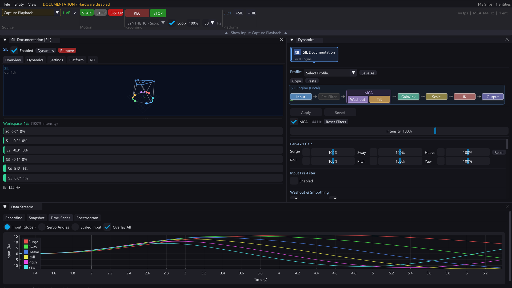
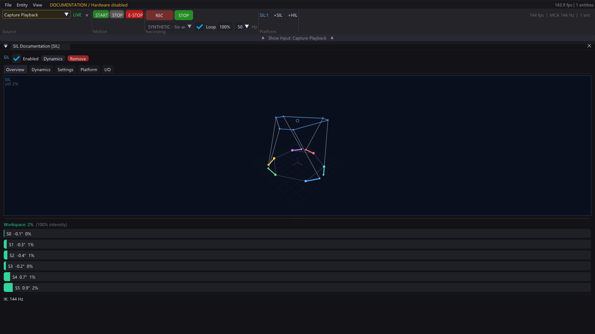
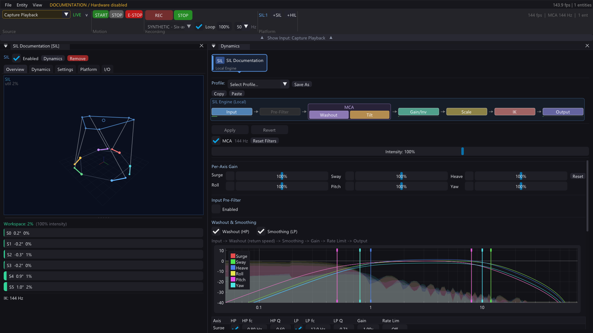
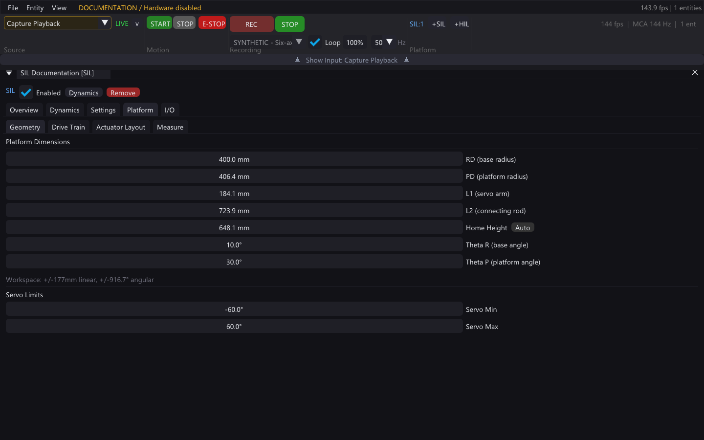
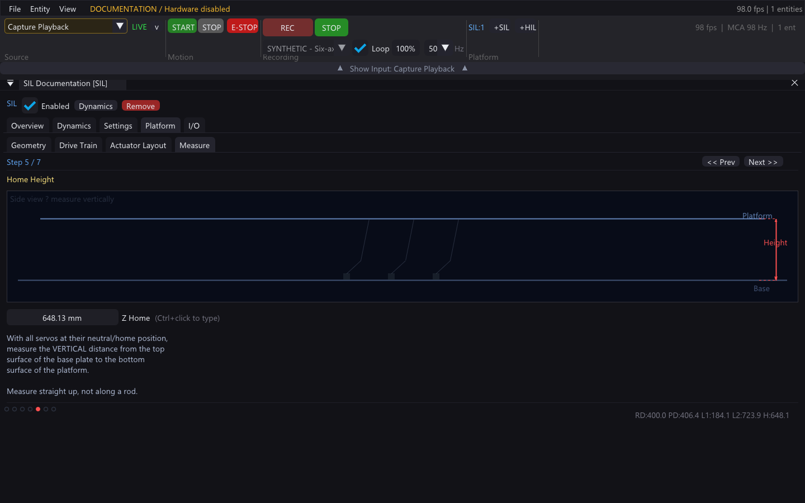
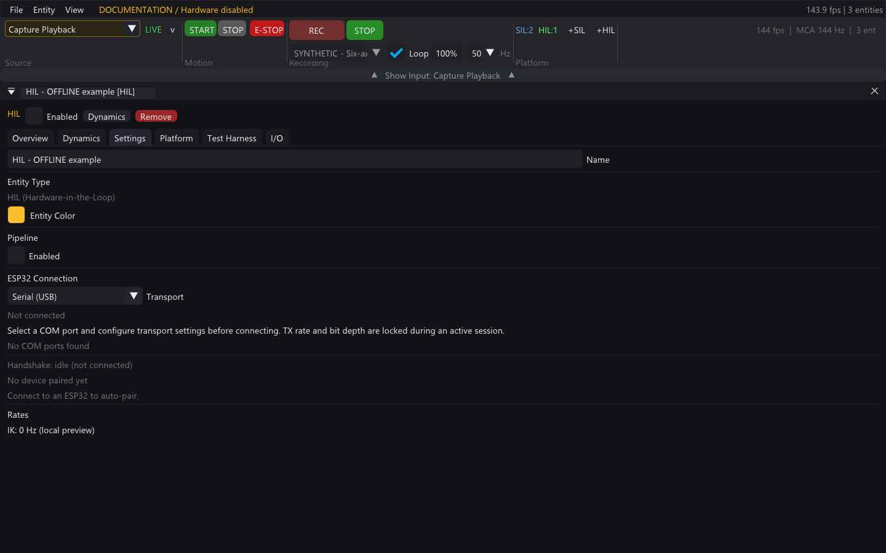
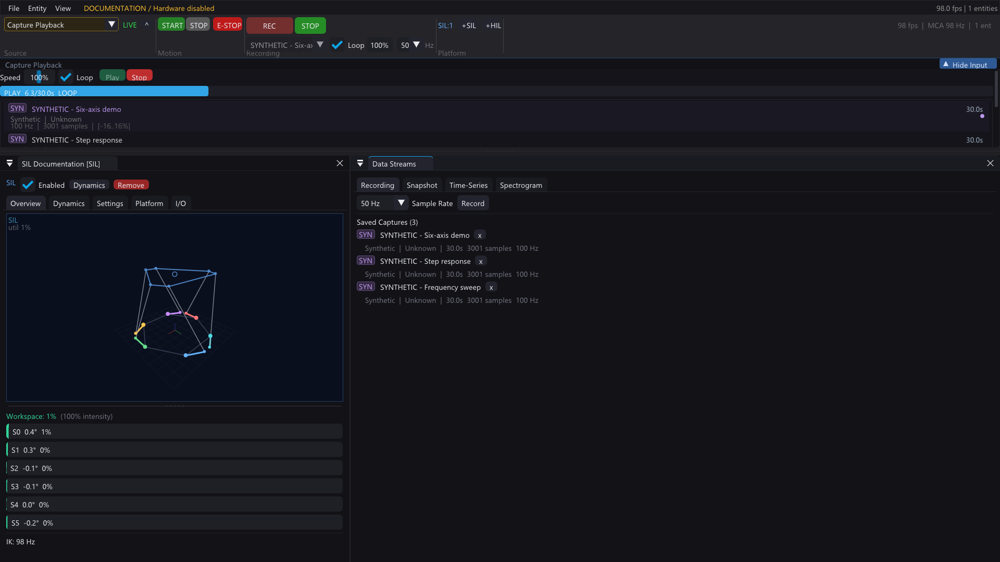
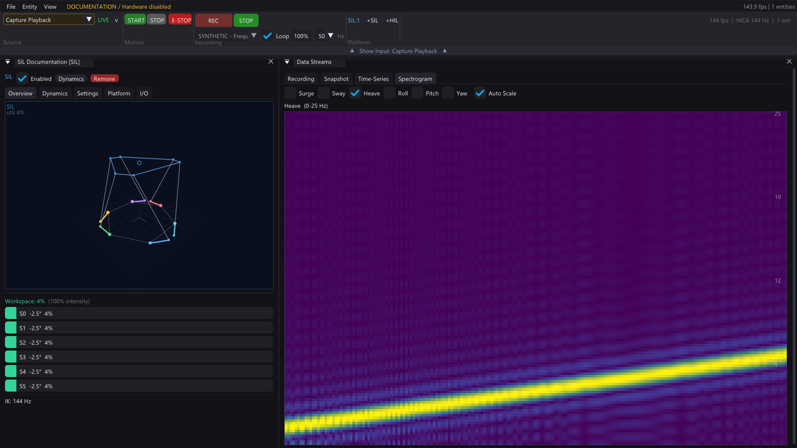
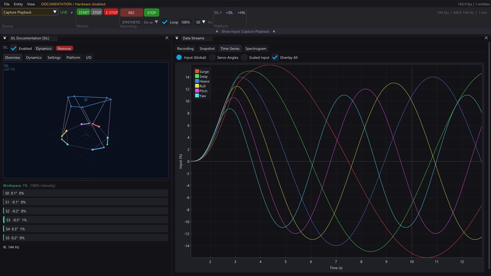
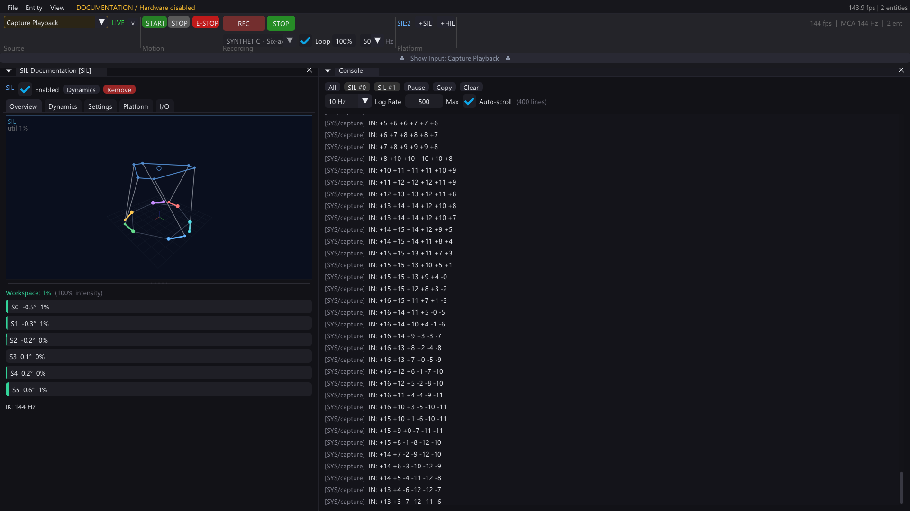

# Stewart Platform — Desktop App Guide

Paths and commands in this guide start at the repository root unless noted otherwise.

> A walkthrough for the native C++/OpenGL/ImGui desktop application that controls, tunes, and visualises your 6-DOF Stewart motion simulator.

**See also:** [Build guide](BUILD.md) · [Architecture](ARCHITECTURE.md) · [App overview](../app/README.md)

For MCP setup, safe isolated documentation launches and actual app screenshots, see [App automation](APP_AUTOMATION.md).

> **Safety / scope — 2026-09-23:** the r13 PCB and its firmware combination are untested. Screenshots for this guide use synthetic SIL data or a disconnected, explicitly offline HIL entity; they are not evidence of working hardware. Do not connect powered drives using this guide. Follow the [firmware and commissioning gates](../hardware/pcb/6DOF2_FIRMWARE_TODO.md).
>
> The screenshots below show the real app using synthetic SIL data or disconnected HIL views, not hardware telemetry. Long Dynamics and Data Streams panels scroll normally; an image does not show every control.

---

## Table of Contents

- [First Launch](#first-launch)
- [UI Overview](#ui-overview)
- [Toolbar](#toolbar)
- [Entities (SIL & HIL)](#entities-sil--hil)
- [Input Sources](#input-sources)
- [Dynamics (Motion Cueing)](#dynamics-motion-cueing)
- [Platform Setup (Geometry)](#platform-setup-geometry)
- [HIL Mode — Connecting an ESP32](#hil-mode--connecting-an-esp32)
- [Recording & Playback](#recording--playback)
- [Data Streams & Spectrogram](#data-streams--spectrogram)
- [Console](#console)
- [Plugins](#plugins)
- [Settings & Persistence](#settings--persistence)
- [Keyboard Shortcuts](#keyboard-shortcuts)
- [Tips & Troubleshooting](#tips--troubleshooting)

---

## First Launch

```
cd app
.\build\Release\stewart-platform.exe
```

On first launch the app creates two files in the working directory:

| File | Purpose |
|------|---------|
| `stewart_settings.json` | All entity configs, input state, MCA presets, plugin parameters |
| `stewart_imgui.ini` | Window positions, sizes, docking layout |

A default **SIL** (Software-in-the-Loop) entity is created automatically so you can start experimenting immediately — no hardware needed.

---

## UI Overview

The interface is built with **Dear ImGui** and supports full **docking** — every panel can be dragged, tabbed, floated, or hidden. The layout auto-saves between sessions.



The primary entity tabs are **Overview**, **Dynamics**, **Settings**, **Platform**, **Test Harness** (HIL only), and **I/O**. Global **Input**, **Console**, and **Data Streams** panels support the selected workflow.

### Resetting the Layout

**File → Reset Window Layout** restores the default panel arrangement without changing entity configurations.

---

## Toolbar

The toolbar is pinned across the top of the window. It provides quick access to the most common actions without opening any panel.

| Section | Controls | What it does |
|---------|----------|--------------|
| **Source** | Plugin names or Capture Playback; STOPPED / LIVE / READY | Select the source. Changing it stops motion and requires an explicit **START**. **Manual Sliders** is a plugin, not a separate source mode. |
| **Motion** | START / STOP, E-STOP | Start/stop the software motion pipeline. The app's E-STOP is not a substitute for the independent hardware stop/inhibit chain. |
| **Recording** | REC / STOP REC, PLAY / STOP, capture selector, Loop, speed, sample rate | Recording and playback controls. Toolbar REC and starting PLAY require motion started; playback also needs a saved capture. |
| **Platform** | SIL:N / HIL:N counts | Shows entity counts. Use **Entity → Add SIL Entity / Add HIL Entity** to create entities; the displayed +SIL/+HIL buttons are not the documented creation path. |
| **Status** | fps, MCA Hz, entity count | Read-only status bar (right-aligned). |

Motion intensity is in **Dynamics**, not the toolbar. Its **0–150%** editor is staged until **Apply**; values above 100% are not a safety guarantee or recommended hardware setting.

---

## Entities (SIL & HIL)

An **entity** is an independent Stewart platform instance with its own geometry, dynamics config, 3D visualizer, and optional ESP32 connection.

### SIL (Software-in-the-Loop)

- Runs the full pipeline locally: axis scaling → motion cueing → inverse kinematics
- No hardware required — ideal for tuning, testing, and visualization
- Choose **Entity → Add SIL Entity** to add one

### HIL (Hardware-in-the-Loop)

- Connects to a physical ESP32-controlled Stewart platform via USB serial
- Sends motion data to the ESP32; receives telemetry back
- **When offline (ESP32 not connected):** the entity is idle — no IK computation, no animation. The 3D viewport shows the platform at its home position with an "OFFLINE" label.
- **When connected with telemetry:** the 3D viewport shows the real platform pose driven by ESP32 telemetry angles.
- Choose **Entity → Add HIL Entity** to add one

### Entity Tabs



| Tab | Purpose |
|-----|---------|
| **Overview** | 3D platform view, servo readouts, status and connection summary |
| **Dynamics** | Staged filter, motion-cueing and gain configuration |
| **Settings** | Entity identity and HIL connection settings |
| **Platform** | Geometry, drive train, actuator layout and measurement tools |
| **Test Harness** | HIL-only analyzer workflow; not a safe-to-run commissioning shortcut |
| **I/O** | Per-entity communication/log inspection |

Orbit the viewport with the mouse. The divider between the viewport and servo readout is draggable. HIL status distinguishes **OFFLINE**, connected-but-awaiting-telemetry, and actual telemetry; an offline picture must not be mistaken for a measured platform pose.


---

## Input Sources

The **Input** panel controls what data feeds the motion pipeline. All input sources — plugins and capture playback — appear in a single flat dropdown at the top.

### Plugins

Plugins are shared libraries that generate motion data. The app scans `plugins/` relative to its **working directory** on startup. With the launch command above (`cd app`), this is `app/plugins/`; when launched from `app/build/Release`, it is `app/build/Release/plugins/`.

Built-in plugins include:

| Plugin | Description |
|--------|-------------|
| **Manual Sliders** | Direct per-axis control via six sliders (±100%) for basic testing and checkout |
| **Sine Wave Demo** | Simple per-axis sine wave for testing |
| **Test Signal** | Advanced waveform generator with per-axis frequency, amplitude, phase, DC offset, and waveform type (sine/square/triangle/sawtooth) |
| **SimTools UDP** | Receives motion data from SimTools over UDP |
| **Assetto Corsa** | Reads Assetto Corsa shared memory telemetry |

Select a plugin from the dropdown, then configure its parameters in the auto-layout panel below. Parameters are intelligently grouped:
- **Per-axis parameters** (detected by naming convention like `freq_surge`, `amp_sway`) render as compact tables
- **Global parameters** render in a responsive two-column grid

### Capture Playback

Plays back a previously recorded motion capture. Switch the source to Capture Playback and choose a saved recording in the Input/playback controls. The Data Streams panel manages the recording library. Controls include **Play**, **Stop**, loop, and speed adjustment; no Pause control is documented.

---

## Dynamics (Motion Cueing)

The **Dynamics** panel configures the full motion cueing pipeline for a selected entity. Use the **Device** dropdown at the top to choose which entity to edit.

### Profile System

- **Profile banner** shows the currently loaded preset name
- **Copy** — serializes all dynamics settings to clipboard as JSON
- **Paste** — loads dynamics settings from clipboard JSON
- Built-in and user presets available via the preset dropdown

### Sections

| Section | What it controls |
|---------|-----------------|
| **Intensity** | Per-entity motion scale (0–150% UI range); staged until Apply |
| **Axis Gains** | Per-axis multipliers (Surge through Yaw) with invert toggles |
| **Motion Cueing (MCA)** | Washout filter configuration — high-pass and low-pass cutoff frequencies, tilt coordination gains. Presets: Off, Gentle, Moderate, Aggressive, Race. |
| **Occupant Position** | X/Y/Z offset of the rider's head from platform center. Compensates for parasitic translations caused by off-center seating. |

### Staging Buffer

Dynamics controls edit a **staging buffer**, not the live pipeline. Click **Apply** to commit the staged settings, or **Revert** to discard them. Do not infer that a changed slider has already changed the running motion.



This staging rule applies to the Dynamics editor. Geometry controls are separate and can change the entity configuration immediately; make geometry changes in SIL or on an isolated, disabled bench.

---

## Platform Setup (Geometry)

Open the entity's **Platform** tab. Its sub-tabs are **Geometry**, **Drive Train**, **Actuator Layout**, and **Measure**.

### Geometry Tab



| Parameter | Description |
|-----------|-------------|
| **RD** | Base plate radius (center to servo shaft), mm |
| **PD** | Platform plate radius (center to ball joint), mm |
| **L1** | Servo arm length (shaft to rod end), mm |
| **L2** | Connecting rod length (rod end to rod end), mm |
| **Home Height** | Vertical distance base-to-platform when servos at 0° |
| **Theta R** | Base joint pair angle spread |
| **Theta P** | Platform joint pair angle spread |

> **Auto button:** The orange **Auto** button next to Home Height computes the mathematically correct value from your geometry. If it's orange, your current value is off by >0.5 mm. Always click Auto after changing any geometry parameter. See the [README geometry section](../app/README.md#geometry-calibration) for details.

### Drive Train Tab

Configure the selected actuator's drive parameters, including gearing and pulse/PWM conversion. Values must match the physical drive and transmission; screenshots contain example data only.

### Actuator Layout Tab

Inspect or edit per-actuator layout rather than assuming every mechanism uses the symmetric default geometry.

### Measure Tab

Use the measurement tools to inspect geometric relationships and home-height setup. Compare the computed geometry with measurements of the disabled mechanism; this is not a powered homing procedure.



---

## HIL Mode — Connecting an ESP32

> **r13 is not commissioned.** The connection controls below describe the desktop interface, not acceptance of the r13 transport, stop chain or firmware. Keep drives disconnected until the linked commissioning gates pass. The example below is **offline** with no device connection.



### Automatic Connection

1. Choose **Entity → Add HIL Entity** to create a HIL entity
2. Open the entity's **Settings** tab
3. Under **ESP32 Connection**:
   - Select the COM port from the dropdown (or leave blank for auto-detect)
   - Enable **Auto Connect**
4. The app will automatically:
   - Open the serial port
   - Perform a handshake (fingerprint → config exchange → telemetry setup)
   - Start streaming motion data and receiving telemetry

### Connection States

| State | What's happening |
|-------|-----------------|
| **Offline** | No serial connection. Entity is idle — no IK, no animation. |
| **Handshaking** | Serial open, exchanging fingerprint and configuration with ESP32. Progress shown in overlay. |
| **Connected** | Handshake complete. Motion packets streaming to ESP32. Awaiting telemetry flow. |
| **Telemetry Active** | Full bidirectional: motion TX → ESP32, telemetry RX ← ESP32. 3D viz driven by real hardware angles. |

### Auto-Reconnect

If the USB cable is unplugged or the ESP32 resets, the app detects the lost connection and automatically retries every 3 seconds (when Auto Connect is enabled). Manual disconnect via the Settings panel disables auto-reconnect.

### TX Rate & Protocol

Configurable in Settings (when disconnected):

- **TX Rate**: 10–1000 Hz (how fast motion packets are sent to ESP32)
- **Bit Depth**: 8, 10, 12, 14, 16, or 18 bits per axis
- **Protocol**: COBS-framed serial transport
  - Motion data: `CH_DATA18` (18 bytes: 6× uint24 LE, low 18 bits used)
  - Runtime commands: `CH_CMD` (ASCII text)

### COBS Metadata Statistics (HIL panel)

When connected, the HIL panel reports these transport counters:

- `RX bytes` / `TX bytes`: total serial payload bytes seen/sent.
- `Telemetry Hz`: decoded telemetry update rate.
- `seq`: latest telemetry sequence index.
- `rejected`: telemetry frames dropped by sanity checks.
- `COBS delim`: number of `0x00` frame delimiters observed.
- `COBS ok`: successfully decoded COBS frames.
- `COBS fail`: failed COBS decodes (framing/corruption).
- `COBS tel`: telemetry channel frames (`CH_TEL`).
- `COBS resp`: response channel frames (`CH_RESP`).
- `COBS log`: log/debug channel frames (`CH_LOG`).

---

## Recording & Playback

### Recording

1. Switch to the **Data Streams** panel → **Recording** tab
2. Select a **Sample Rate** (50–1000 Hz)
3. Click **Record** — captures the current input source data
4. Click **Stop Recording** when done. A non-empty recording is automatically saved to the library with a timestamp/source name and selected for playback.
5. Use **Save to Library** only when you intentionally want another named copy; it adds a duplicate, not a rename of the automatically saved entry.

Recordings are saved as `.stwr` files with a `manifest.json` index in `recordings/` under the working directory (`app/recordings/` for the launch command above).



### Playback

1. Switch the input source to **Capture Playback** (toolbar or Input panel)
2. Choose a saved capture in the Input/playback controls; the Data Streams → Recording tab manages the library
3. In SIL, enable **START**, then use **Play**, **Stop**, and **Loop** controls. This is not permission to start a connected uncommissioned platform.
4. Adjust playback speed from **10–200% (0.1×–2×)** in the UI

### What Gets Recorded

The recording captures the **6-axis input percentages** at the configured sample rate, regardless of which input source is active. This means you can record from a plugin (e.g., Assetto Corsa), save it, and replay it later without the game running.

---

## Data Streams & Spectrogram

The **Data Streams** panel contains multiple tabs for signal analysis:

### Recording Tab

Capture library management (see [Recording & Playback](#recording--playback) above).

### Snapshot Tab

Inspect a snapshot of the six input axes and entity data. The current tab is named **Snapshot**, not Frequency.

### Spectrogram Tab

Rolling waterfall heatmap showing frequency content over time. Supports multi-entity and multi-axis lane selection. Color intensity maps to signal power — bright spots indicate dominant frequencies. A synthetic signal illustrates the display; it does not identify the physical mechanism's resonances.



### Time-Series Tab

Scrolling plots of input/output signals. Compare selected entities or axes side-by-side.



---

## Console



The **Console** panel shows timestamped log messages from all subsystems:

- **Entity filter buttons** — click to show/hide messages from specific entities
- **Pause** — freeze the log (messages still queue, displayed on resume)
- **Copy** — copy visible log to clipboard
- **Clear** — wipe the log
- **Rate limiter** — dropdown to throttle log output (e.g., 10 Hz) to prevent flooding

Log categories include: `hil`, `sil`, `serial`, `platform`, `record`, `plugin`, etc.

### Per-Entity I/O Monitor

Each entity also has its own **I/O** tab. This shows only messages related to that specific entity — useful when debugging a single ESP32 connection.

---

## Plugins

Plugins are shared libraries (`.dll` on Windows) that implement the Stewart Plugin API. They run in-process and generate 6-axis motion data at the app's frame rate.

### Plugin Directory

```
plugins/                         # relative to the working directory
├── plugin_sine_demo.dll
├── plugin_test_signal.dll
├── plugin_simtools_udp.dll
└── plugin_assetto_corsa.dll
```

The app scans this working-directory-relative folder on startup, not automatically the executable's directory. Valid plugin names appear directly in the Source dropdown. Documentation mode deliberately does not load them.

### Using a Plugin

1. Open the Source dropdown in the toolbar/Input controls
2. Select the desired plugin by name
3. Configure parameters using the auto-generated UI
4. In SIL, press **START** to activate the selected source. Selecting a different source stops motion until you start it again.

### Plugin Parameters

Parameters are auto-detected from the plugin's `stewart_plugin_info()` export. The UI engine automatically:

- Groups per-axis parameters (e.g., `freq_surge`, `freq_sway`, ..., `freq_yaw`) into compact tables
- Renders global parameters in a responsive grid
- Supports float, int, bool, and enum parameter types
- Shows live output bars when the plugin is active

### Building a Plugin

See `app/plugins/` for source examples. Each plugin is a single C file compiled to a DLL:

```bat
cd app\plugins
build_plugin.bat
```

The supplied batch file builds the listed example plugins; it does not accept an arbitrary source filename. Add an appropriate compiler command for a new plugin.

The plugin API requires **four** exports:

- `stewart_plugin_info()` — returns plugin metadata and parameter definitions
- `stewart_plugin_init()` — called when the plugin is activated
- `stewart_plugin_process()` — called every frame, produces 6-axis output
- `stewart_plugin_shutdown()` — called when the plugin is deactivated

---

## Settings & Persistence

### Auto-Save

The app automatically saves all settings to `stewart_settings.json` on exit and periodically during operation. This includes:

- All entity configurations (geometry, dynamics, axis scales, motor settings)
- Input source selection and plugin parameters
- HIL connection settings (COM port, TX rate, auto-connect)
- MCA presets (built-in + user-created)
- Recording library manifest
- Window layout (separate file: `stewart_imgui.ini`)

### Settings File Location

Settings are saved relative to the working directory where the app was launched. Typically:

```
app/stewart_settings.json
app/stewart_imgui.ini
app/recordings/manifest.json
app/recordings/000.stwr, 001.stwr, ...
```

### Resetting Settings

Delete `stewart_settings.json` to reset all entity configs and preferences to defaults. Delete `stewart_imgui.ini` to reset the window layout.

---

## Keyboard Shortcuts

Use **File → Save** and **File → Exit**. The Save menu displays `Ctrl+S`, but a menu hint alone does not prove that the keyboard shortcut is implemented. `Ctrl+Q` is not implemented; it is not an exit instruction for this build.

---

## Tips & Troubleshooting

### General

- **Panels disappeared?** Use **File → Reset Window Layout** to restore the default arrangement.
- **App won't start?** Ensure your GPU supports OpenGL 3.3+. Update drivers if needed.
- **Settings corrupted?** Delete `stewart_settings.json` and restart.

### HIL / ESP32

- **Can't find COM port?** The ESP32-S3 uses native USB CDC — no FTDI driver needed. Ensure you're using the USB port (not UART) on the DevKitC. Try unplugging and re-plugging.
- **Handshake stuck?** The app sends a `FINGERPRINT?` command and waits for a response. If the ESP32 firmware is outdated or unresponsive, the handshake will time out. Reflash the firmware.
- **Telemetry not flowing?** After successful handshake, the app requests telemetry via `TELRATE:N`. If the ESP32 doesn't respond, check firmware version compatibility.
- **HIL entity shows "OFFLINE"?** This is normal when the ESP32 is not connected. The entity stays offline; the application still renders its interface and checks connection state.

### Plugins

- **Plugin not appearing?** Ensure the DLL is in `plugins/` under the app's working directory. The app only scans on startup — restart after adding new plugins.
- **Plugin crashes?** Check the Console for error messages. Plugins run in-process, so a crash will take down the app. Debug with the per-entity I/O monitor.

### Performance

- **Low frame rate?** The app targets vsync (~60 fps). If it's lower, check if too many entities are active or if the spectrogram is consuming excessive resources.
- **High CPU usage?** Normal during active motion — the pipeline runs every frame. When idle (no input source active, HIL offline), CPU usage should be minimal.

---

## Glossary

| Term | Definition |
|------|-----------|
| **SIL** | Software-in-the-Loop — local simulation, no hardware |
| **HIL** | Hardware-in-the-Loop — connected to a physical ESP32 + servos |
| **IK** | Inverse Kinematics — computes servo angles from desired platform pose |
| **FK** | Forward Kinematics — computes platform pose from servo angles |
| **MCA** | Motion Cueing Algorithm — washout filters that map game telemetry to safe platform motion |
| **Telemetry** | Data streamed back from the ESP32 (servo angles, positions) |
| **Entity** | An independent platform instance with its own config and pipeline |
| **Plugin** | External DLL that generates motion data (e.g., game telemetry reader) |
| **Home Position** | Platform at rest — all servos at 0°, platform level and parallel to base |
| **Utilization** | How close a servo is to its angular limits (0–100%) |

---

*This guide is a living document. Update it as features are added or workflows change.*
