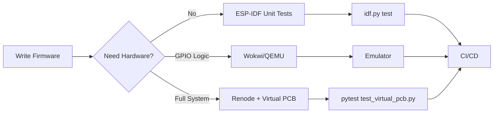

# Hardware Simulation & Pre-Fabrication Testing

This directory contains simulation models and scripts for validating the PCB design **before ordering physical boards**.

## Directory Structure

```
simulation/
├── README.md                  # This file
├── esp32_emulation/           # ESP32-S3 firmware emulation
│   ├── qemu_esp32s3/          # QEMU-based ESP32-S3 emulator
│   ├── renode/                # Renode multi-core emulation
│   ├── wokwi/                 # Wokwi online simulator
│   └── unit_tests/            # ESP-IDF unit tests (host)
├── ltspice/                   # LTspice circuit simulations
│   ├── level_translator.asc   # SN74LVCH16T245 model
│   ├── rs422_driver.asc       # AM26C31 differential driver
│   ├── estop_opto.asc         # TLP2361 E-stop circuit
│   ├── buck_regulator.asc     # LMR33630 power supply
│   └── run_all_sims.sh        # Automated SPICE runner
├── signal_integrity/          # High-speed signal analysis
│   ├── differential_pair.py   # Impedance calculator
│   ├── eye_diagram.py         # Digital signal quality
│   └── requirements.txt       # Python dependencies
├── virtual_pcb/               # Python hardware models
│   ├── virtual_pcb.py         # Complete PCB simulation
│   ├── test_virtual_pcb.py    # Integration tests
│   └── components/            # Individual component models
└── preflight_check.sh         # Complete pre-fab validation

```

## Quick Start

### 1. Python-Based Validation (No Additional Software)

```bash
# Already works - runs in CI/CD
pytest ../tests/test_servo_interface.py -v
pytest ../tests/test_kicad_project.py -v

# Results: 30 tests validating electrical specifications
```

### 2. SPICE Circuit Simulation (Install LTspice)

```bash
# Download LTspice (free): https://www.analog.com/en/design-center/design-tools-and-calculators/ltspice-simulator.html

# Run simulations
cd ltspice
./run_all_sims.sh

# View results
# Open *.asc files in LTspice
# Check waveforms meet specifications
```

### 3. Signal Integrity Analysis

```bash
# Install Python dependencies
cd signal_integrity
pip install -r requirements.txt

# Calculate differential pair impedance
python differential_pair.py \
  --width 0.25 \
  --gap 0.25 \
  --height 0.2 \
  --er 4.5

# Expected output: ~120Ω
```

### 4. Virtual Hardware Testing

```bash
# Test firmware integration without physical PCB
cd virtual_pcb
pip install -r requirements.txt
pytest test_virtual_pcb.py -v

# Simulates:
# - Level translator delays
# - RS-422 output voltages
# - E-stop response time
# - Step pulse timing validation
```

### 5. ESP32-S3 Firmware Emulation

Test firmware **without physical ESP32-S3 hardware** for faster iteration and CI/CD integration.

#### Option 1: QEMU (ESP32-S3 Support)

```bash
# Install QEMU with ESP32 support
git clone https://github.com/espressif/qemu.git
cd qemu
./configure --target-list=xtensa-softmmu \
  --enable-gcrypt \
  --enable-slirp \
  --disable-xen
make -j$(nproc)
sudo make install

# Run firmware in emulator
cd esp32_emulation/qemu_esp32s3
qemu-system-xtensa \
  -nographic \
  -machine esp32s3 \
  -drive file=firmware.bin,if=mtd,format=raw
```

**Limitations**: Peripheral emulation incomplete (RMT, UART timing may differ)

#### Option 2: Renode (Full SoC Simulation)

```bash
# Install Renode
# See: https://renode.io/

# Create ESP32-S3 platform file
renode esp32s3_stewart.repl

# Run firmware
(monitor) machine LoadPlatformDescription @esp32s3_stewart.repl
(monitor) sysbus LoadELF @firmware.elf
(monitor) start
```

**Advantages**:
- Full peripheral modeling (GPIO, UART, SPI, I2C)
- Multi-core support (ESP32-S3 dual-core)
- Can connect virtual hardware models
- CI/CD friendly (scriptable)

#### Option 3: Wokwi (Online Simulator)

**Quick prototyping**: https://wokwi.com/

```bash
# Create diagram.json for ESP32-S3
{
  "parts": [
    { "type": "wokwi-esp32-s3-devkitc-1", "id": "esp" },
    { "type": "wokwi-led", "id": "led1" }
  ],
  "connections": [
    [ "esp:GPIO2", "led1:A", "green", [] ]
  ]
}
```

**Limitations**: Cloud-based, limited peripheral set

#### Option 4: ESP-IDF Unit Tests (Host-Based)

**Best for algorithm testing** (no hardware dependencies):

```bash
# In Controller/
idf.py create-unit-test inverse_kinematics_test

# main/inverse_kinematics_test.c
#include "unity.h"
#include "InverseKinematics.h"

TEST_CASE("IK solver: surge motion", "[kinematics]") {
    Platform platform;
    platformInit(&platform);
    
    Pose pose = {.surge = 10.0, .sway = 0, .heave = 0};
    calculateIK(&platform, &pose);
    
    TEST_ASSERT_FLOAT_WITHIN(0.1, expected_L1, platform.legLengths[0]);
}

# Run on host (no ESP32 required)
idf.py test
```

**Integration with Virtual PCB**:

```python
# virtual_pcb/test_firmware_integration.py
import subprocess
import serial
import pytest

def test_step_pulse_width_emulated():
    """Verify step pulses meet 5µs minimum using QEMU"""
    # Start QEMU with firmware
    qemu = subprocess.Popen([
        "qemu-system-xtensa",
        "-machine", "esp32s3",
        "-serial", "pty",  # Create virtual serial port
        "-drive", "file=firmware.bin,if=mtd,format=raw"
    ], stdout=subprocess.PIPE)
    
    # Parse QEMU output for serial port
    pty_line = qemu.stdout.readline().decode()
    pty_path = pty_line.split()[-1]  # e.g., /dev/pts/3
    
    # Connect to virtual UART
    ser = serial.Serial(pty_path, 115200, timeout=1)
    
    # Send command to firmware
    ser.write(b"STEP_TEST\n")
    
    # Virtual PCB measures pulse width
    response = ser.readline().decode()
    pulse_width_us = float(response.split(":")[-1])
    
    assert pulse_width_us >= 5.0, f"Pulse too short: {pulse_width_us}µs"
    
    qemu.terminate()
```

#### ESP32 Emulation Workflow



**When to Use Each Tool**:

| Tool | Best For | Limitations |
|------|----------|-------------|
| **ESP-IDF Unit Tests** | Algorithm logic, math functions | No GPIO, no timing |
| **Wokwi** | Quick prototyping, demos | Cloud-based, limited peripherals |
| **QEMU** | Basic firmware testing | Incomplete peripheral models |
| **Renode** | Full system simulation, CI/CD | Complex setup, learning curve |

## Simulation Goals

### What We Validate

✅ **Electrical Specifications** (via Python tests)
- RS-422 voltage levels: ±2.0V to ±2.5V differential
- Input impedance: 12kΩ typ
- E-stop opto current: 9.5mA (with R19=2.4kΩ)
- Buck regulator ripple: <50mV
- Signal rise times: <50ns

✅ **Circuit Behavior** (via SPICE)
- Transient response to step pulses
- Power supply startup and stability
- Frequency response of signal paths
- Noise margins and interference

✅ **Signal Integrity** (via Python/SPICE)
- Differential pair impedance: 120Ω ±10%
- Trace length matching: <5mm mismatch
- Crosstalk between adjacent pairs
- Termination effectiveness

✅ **Firmware Integration** (via Virtual PCB + Emulation)
- 1000Hz update rate achievable
- Step pulse width meets AASD-15A requirements (≥5µs)
- Direction setup and hold times
- E-stop detection latency
- Inverse kinematics accuracy (host unit tests)
- RMT timing precision (QEMU/Renode)

### What We DON'T Simulate (Yet)

⚠️ **Thermal Analysis** - Requires FEA (future enhancement)
⚠️ **EMI/EMC** - Requires specialized tools
⚠️ **Mechanical Stress** - Connector strain, vibration
⚠️ **Long-term Reliability** - MTBF, component aging

## Simulation Workflow

### For Each Design Change:

1. **Update Documentation** (`docs/hardware/servo_driver_interface.md`)
2. **Update Python Tests** (`hardware/tests/test_servo_interface.py`)
3. **Run Python Validation**:
   ```bash
   pytest ../tests/ -v
   ```
4. **Update SPICE Models** (if analog circuit changed)
5. **Run SPICE Simulations**:
   ```bash
   cd ltspice
   ./run_all_sims.sh
   ```
6. **Validate Signal Integrity** (if high-speed path changed):
   ```bash
   cd signal_integrity
   python differential_pair.py
   ```
7. **Update KiCad Design**
8. **Run Pre-Flight Check**:
   ```bash
   ./preflight_check.sh
   ```
9. **Commit All Changes** (docs, tests, simulations, KiCad)

### Before Ordering PCBs:

```bash
# Complete validation suite
./preflight_check.sh

# Manual checklist:
# [ ] All automated tests pass
# [ ] SPICE simulations reviewed
# [ ] Signal integrity within spec
# [ ] BOM components available from distributors
# [ ] KiCad DRC clean (0 errors)
# [ ] Gerber files visually inspected in viewer
# [ ] (Optional) Critical circuits breadboard-tested
```

## Tool Installation

### LTspice (Recommended for SPICE)

**Windows/macOS/Linux:**
1. Download from: https://www.analog.com/en/design-center/design-tools-and-calculators/ltspice-simulator.html
2. Install (free, no registration required)
3. Open `.asc` files in `ltspice/` directory

### ngspice (Open Source Alternative)

**Linux:**
```bash
sudo apt install ngspice gaw  # gaw = waveform viewer
```

**macOS:**
```bash
brew install ngspice
```

**Windows:**
- Download from: http://ngspice.sourceforge.net/download.html

### KiCad 7.0+ (Has Built-in SPICE)

**All Platforms:**
1. Install KiCad 7.0+: https://www.kicad.org/download/
2. Open schematic
3. Tools → Simulator
4. Add SPICE models to components
5. Run analysis (transient, AC, DC)

### Python Tools

```bash
# Signal integrity analysis
pip install scikit-rf numpy matplotlib scipy

# Virtual PCB simulation
pip install pyserial numpy pytest
```

## Example Simulation Results

### E-Stop Opto Current (LTspice)

**Specification**: 9.5mA ±5% through TLP2361 LED

**SPICE Results**:
```
R19 = 2.2kΩ → 10.36mA ❌ EXCEEDS 10mA MAX
R19 = 2.4kΩ → 9.50mA  ✅ WITHIN SPEC
R19 = 2.7kΩ → 8.44mA  ✅ WITHIN SPEC (more margin)
```

**Decision**: Used 2.4kΩ for 5% safety margin below 10mA absolute maximum.

This simulation **caught a design error** that would have damaged the opto-isolator!

### Differential Pair Impedance (Python)

**Specification**: 120Ω ±10% (108-132Ω)

**Python Calculator Results**:
```python
# Input parameters
trace_width = 0.25   # mm
trace_gap = 0.25     # mm
dielectric_h = 0.2   # mm (FR-4, h between layers)
epsilon_r = 4.5      # FR-4

# Calculated impedance
Z_diff = 119.8Ω      # ✅ Within 120Ω ±10%
```

**PCB Stackup Validated**: 4-layer FR-4, 1.6mm total thickness

### Buck Regulator Ripple (SPICE)

**Specification**: <50mV peak-to-peak @ 5V output

**SPICE Results**:
```
Load: 2A (max)
Output ripple: 31.2mV p-p  ✅ WITHIN SPEC
Frequency: 400kHz
Output caps: C7+C8 = 20µF
```

**Validation**: LMR33630 with 10µF × 2 bulk caps meets ripple requirement

## Contributing

When adding new simulations:

1. Place in appropriate subdirectory (`ltspice/`, `signal_integrity/`, etc.)
2. Document what specification is being validated
3. Include pass/fail criteria in comments
4. Add to `preflight_check.sh` if critical
5. Update this README with results

## Future Enhancements

- [ ] **ESP32 Emulation in CI/CD** - Automated firmware testing with Renode
- [ ] **Hardware-in-Loop (HIL)** - Real ESP32-S3 + Virtual PCB Python model
- [ ] Thermal simulation (FEA)
- [ ] EMI pre-compliance testing
- [ ] PCB capacitance extraction
- [ ] Automated Gerber DFM checks
- [ ] BOM cost optimization
- [ ] Alternative component suggestions
- [ ] Monte Carlo analysis (component tolerances)

## Resources

### Hardware Simulation
- **LTspice Tutorial**: https://www.analog.com/en/design-center/design-tools-and-calculators/ltspice-simulator.html
- **KiCad SPICE Guide**: https://docs.kicad.org/7.0/en/eeschema/eeschema.html#spice-simulation
- **Transmission Line Calculator**: https://www.eeweb.com/tools/microstrip-impedance/
- **Signal Integrity**: "High-Speed Digital Design" by Howard Johnson

### ESP32 Emulation
- **QEMU ESP32**: https://github.com/espressif/qemu
- **Renode**: https://renode.io/ (full SoC simulation)
- **Wokwi**: https://wokwi.com/ (online ESP32-S3 simulator)
- **ESP-IDF Unit Testing**: https://docs.espressif.com/projects/esp-idf/en/latest/esp32s3/api-guides/unit-tests.html
- **Renode ESP32 Tutorial**: https://renode.readthedocs.io/en/latest/tutorials/esp32-demo.html

---

**Remember**: Simulation is a powerful tool, but **breadboarding critical circuits** provides the highest confidence before PCB fabrication!
